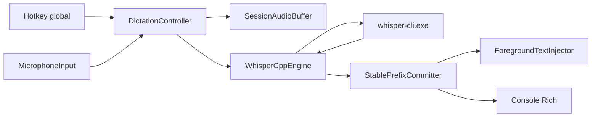

# Data Flow & Integrations

O sistema trabalha com um pipeline local: evento de hotkey abre uma sessao, o microfone produz chunks PCM, o controlador acumula audio, o engine executa `whisper-cli`, e a saida textual e enviada ao terminal e ao injetor de texto. Nenhum dado precisa sair da maquina para a v1.

## Module Dependencies

- `cli.py` -> `config.py`, `diagnostics.py`, `engine.py`, `app.py`
- `app.py` -> `audio.py`, `engine.py`, `hotkey.py`, `injector.py`, `overlay.py`, `stabilization.py`
- `engine.py` -> `audio.py`, `config.py`
- `diagnostics.py` -> `audio.py`, `engine.py`, `hotkey.py`, `injector.py`
- `tests/` -> modulos de `src/whispr/`

## Service Layer

- [src/whispr/app.py](/D:/repositorio/bc-developer/whispr-codex/src/whispr/app.py:26) - `DictationController` coordena eventos e estado transitorio.
- [src/whispr/engine.py](/D:/repositorio/bc-developer/whispr-codex/src/whispr/engine.py:39) - `WhisperCppEngine` encapsula subprocessos de transcricao.
- [src/whispr/audio.py](/D:/repositorio/bc-developer/whispr-codex/src/whispr/audio.py:37) - `MicrophoneInput` coleta audio de entrada.
- [src/whispr/injector.py](/D:/repositorio/bc-developer/whispr-codex/src/whispr/injector.py:78) - estrategias de entrega de texto para a janela ativa.

## High-level Flow

Ao pressionar a hotkey, `DictationController.on_press()` cria `DictationSession` com `SessionAudioBuffer`. `MicrophoneInput` chama `on_audio()` continuamente, e o loop principal executa `tick()` a cada ~50 ms. Quando a janela de audio minima e atingida, o controlador pede uma transcricao parcial, passa a hipotese ao `StablePrefixCommitter` e injeta apenas o delta. Ao soltar a hotkey, o fluxo gera uma transcricao final e imprime o resultado consolidado no terminal.

## Internal Movement

O estado fica em memoria dentro de `DictationSession`. Nao existe fila persistente, IPC dedicado nem armazenamento intermediario. O unico limite externo e a execucao de `whisper-cli` num diretorio temporario, onde o modulo grava `capture.wav` e le `capture.txt`.

## External Integrations

- `whisper-cli.exe`: recebe WAV local e devolve texto bruto.
- `sounddevice.RawInputStream`: entrega frames PCM 16-bit mono.
- `keyboard`: assina eventos de pressionar/soltar tecla globalmente.
- Win32 clipboard e `SendInput`: aplicam texto na janela em foco.

## Observability & Failure Modes

O projeto usa mensagens no terminal com `rich` como observabilidade primaria. Falhas comuns: binario `whisper-cli` ausente, modelo `ggml` inexistente, erro de driver/audio, problemas com clipboard e indisponibilidade da biblioteca `keyboard`.

## Related Resources

- [architecture.md](/D:/repositorio/bc-developer/whispr-codex/.context/docs/architecture.md:1)
- [testing-strategy.md](/D:/repositorio/bc-developer/whispr-codex/.context/docs/testing-strategy.md:1)
